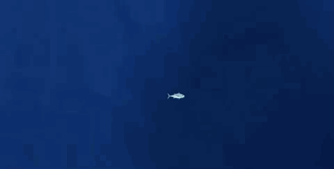

# Hungry Fish
*This project was made during my year of study at UHA 2019*

## Description
A little agar.io like game made with **JavaFx**.
The goal consist to eat other fish to become bigger and eat bigger fish.

*All the students have chosen their own game concept*

This game was made to practice :
* JavaFx
* MVC
* Object heritage
* Thread Process

## Menu
This Menu is base on a parallax effect with different layer moving according to the mouse movement.

## Game
A quick in game view sample :

